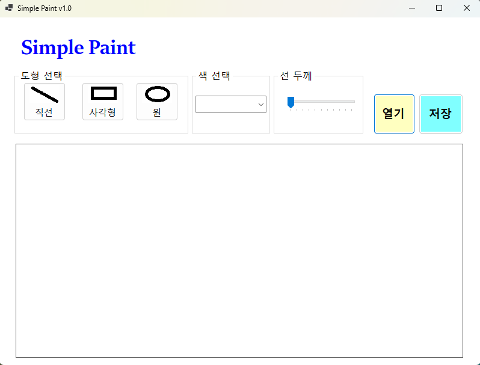
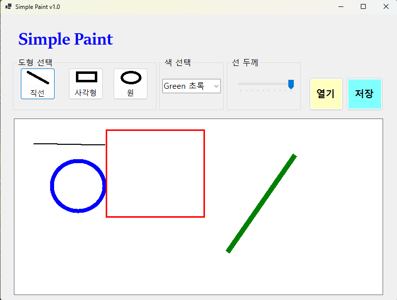
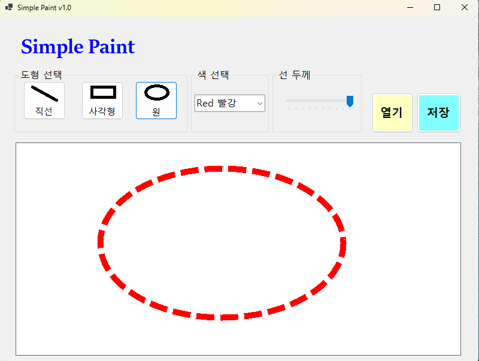

# (C# 코딩)

## 개요
- C# 프로그래밍 학습
- 1줄 소개: 직선, 사각형, 원을 그리는 그림판 프로그램
- 사용한 플랫폼: C#, .NET Windows Forms, Visual Studio, GitHub

- 사용한 컨트롤 ;
  - Button : 도형 선택 버튼
  - ComboBox : 색상 선택 콤보박스
  - TrackBar : 선 굵기 선택 트랙바
  - PictureBox : 캔버스 역할을 하는 픽쳐박스
- 사용한 기술과 구현한 기능:
  - MouseDown, MouseMove, MouseUp 이벤트를 이용해서 도형 그리기 구현
  - 도형 종류에 따라 직선, 사각형, 원을 그리는 로직 구현
  - 선택한 색상과 선 굵기를 적용해서 도형 그리기 구현
  - 도형 그리기 중 마우스를 놓기 전에는 점선으로 모양 보이도록 구현

## 실행화면 1
- 코드의 실행 스크린샷과 구현 내용 설명

- 구현한 내용 (위 그림 참조)
  - UI 구성 : 도형 선택, 색선택, 굵기선택, 캔버스 구성
  - 도형 선택 : 버튼 3개를 이용해서 직선, 사각형, 원 선택
  - 색 선택 : ComboBox를 이용해서 검은색, 빨간색, 파란색, 초록색 선택
  - 선 굵기 선택 : TrackBar 이용해서 선 굵기를 1~10단계로 선택
  - 캔버스 : PictureBox를 이용해서 캔버스 구성

## 실행화면 2
- 코드의 실행 스크린샷과 구현 내용 설명

- 구현한 내용 (위 그림 참조)
  - 도형 그리기 : PictureBox의 MouseDown, MouseMove, MouseUp 이벤트를 이용해서 도형 그리기 구현
  - 도형 종류에 따라 직선, 사각형, 원을 그리는 로직 구현
  - 선택한 색상과 선 굵기를 적용해서 도형 그리기 구현
  - 도형 그리기 중 마우스를 놓기 전에는 점선으로 모양 보이도록 구현

## 실행화면 3
- 코드의 실행 스크린샷과 구현 내용 설명

## 실행화면 4
- 코드의 실행 스크린샷과 구현 내용 설명

